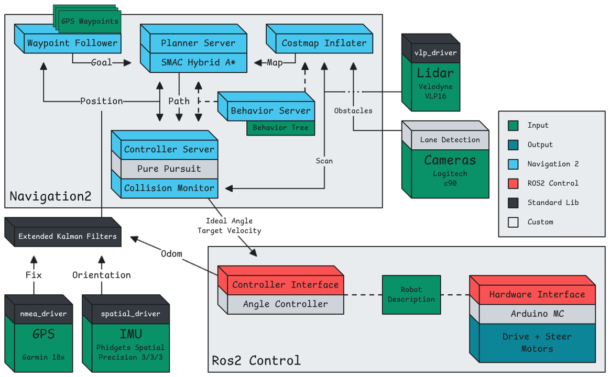

# Polor Autonomous
IGVC 2026

See the [Final Proposal](./IGVC%20Final%20Proposal.pdf) for in-depth information and references.

## Full Diagram


## Demo

Click below to watch the simulation:

[](https://youtu.be/WGtT7YmnFjI)

## Installation

To use this software you first need an ubuntu 22 environment:

1.  Ubuntu computer
2.  [WSL](https://learn.microsoft.com/en-us/windows/wsl/install)
3.  [VM](https://www.virtualbox.org)

Once you are in, I reccomend setting up [ssh with git.](https://docs.github.com/en/authentication/connecting-to-github-with-ssh) This will make pushing and pulling eaiser.

Either way, clone this repo, and navigate to it via terminal:

```bash
git clone git@github.com:e-spinner/igvc.git && cd igvc
```

### Installing Ros

The following script will install ros-humble and the required packages for this repo + build the software:

```bash
./setup.sh
```

> If this raises a permision denied error. run `chmod +x ./setup.sh` and try again.

### Setting up Sensors

If you need to use the Sensors, run the following command to setup udev rules that the software relies on to identify which usb port devices are in:

```bash
sudo cp 99-usb-sensors.rules /etc/udev/rules.d/99-usb-sensors.rules
```

now reload the udev rules:

```bash
sudo udevadm control --reload-rules
sudo udevadm trigger
```


### Building the software again

```bash
colcon build --symlink-install --cmake-args -DCMAKE_EXPORT_COMPILE_COMMANDS=ON --packages-select igcv26
```

## Usage

### Package Structure

The igvc package contains:

- `behavior/` - Behavior tree configurations for autonomous navigation
- `config/` - Configuration files for ros nodes
- `description/` - Robot URDF models (ackermann, ackermann_linkage, ...)
- `igvc_py/` - Python nodes
- `launch/` - Launch files to start different systems
- `msg/` - Custom ROS message definitions
- `src/` - C++ nodes
- `worlds/` - Gazebo simulation worlds

### Running the System

After building, source the workspace:

```bash
source install/setup.bash
```

Run different system configurations:

```bash
# Ackermann linkage visualzation + control by joy-teleop
ros2 launch igvc ack.launch.py linkage_config:=2

# Navigation stack  --- intended to be used on top of sim
ros2 launch igvc nav.launch.py

# Simulation environment + basic ackermann robot
ros2 launch igvc sim.launch.py

# Vision sensors drivers (GPS and IMU)
ros2 launch igvc vision.launch.py
```
